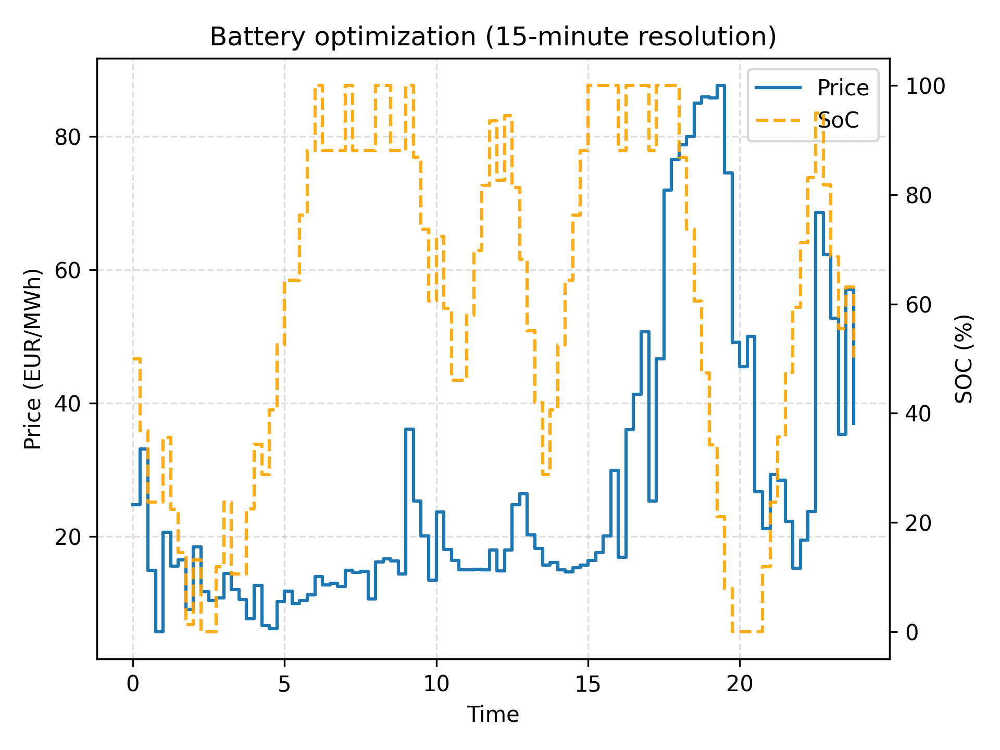
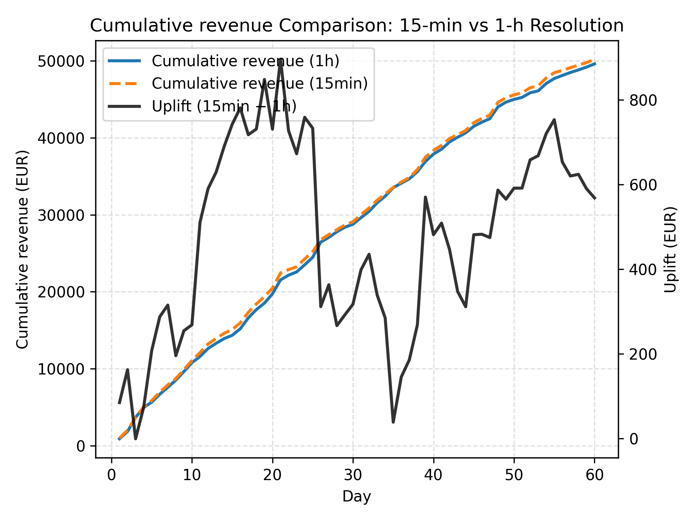

# Battery Arbitrage Optimization (Pyomo) —  Wholesale Market

This project optimizes the operation of a battery on the wholesale electricity market (DA and IA) to maximize arbitrage profit by deciding, at each time step, whether to charge, discharge, or remain idle. A linear optimization problem is solved independently for each day of a price time series, enabling the analysis of profitability and battery usage under different market time resolutions (1h vs 15min).

## Key Features
- Pyomo-based linear optimization of battery dispatch
- Charge/discharge power limits and energy capacity constraints
- Charging and discharging efficiencies
- Automatic timestep inference (hourly or 15-minute data)
- Independent daily optimization with optional terminal SOC constraint
- Daily KPIs: profit, throughput, and equivalent full cycles

## Model Description
For each time step `t`, the optimization decides:
- Charging power `p_ch[t]` (MW)
- Discharging power `p_dis[t]` (MW)
- State of charge `soc[t]` (MWh)

State of charge dynamics:

$$
\begin{aligned}
\text{soc}_{t+1} = \text{soc}_{t} + \left(\eta_{ch}\*P_{ch, t} - \frac{1}{\eta_{dis}}\*P_{dis, t}\right)\*dt
\end{aligned}
$$

Objective function (maximize arbitrage profit):

$$
\begin{aligned}
\max \quad & \sum_{t} \text{price}_{t}\*
\left( P_{dis,t} - P_{ch,t} \right)\* dt
\end{aligned}
$$

## Part 1 Impact of the change in timestep (15min vs 1h) - Day-Ahead Market

The model is designed to assess how shorter bidding intervals and increased price volatility impact:
- Optimal dispatch strategies
- Arbitrage profitability
- Battery cycling intensity

  
  

  

## Part 2 Multi-Market Battery Dispatch Optimization - Day-Ahead & Intraday Markets

Work in progress